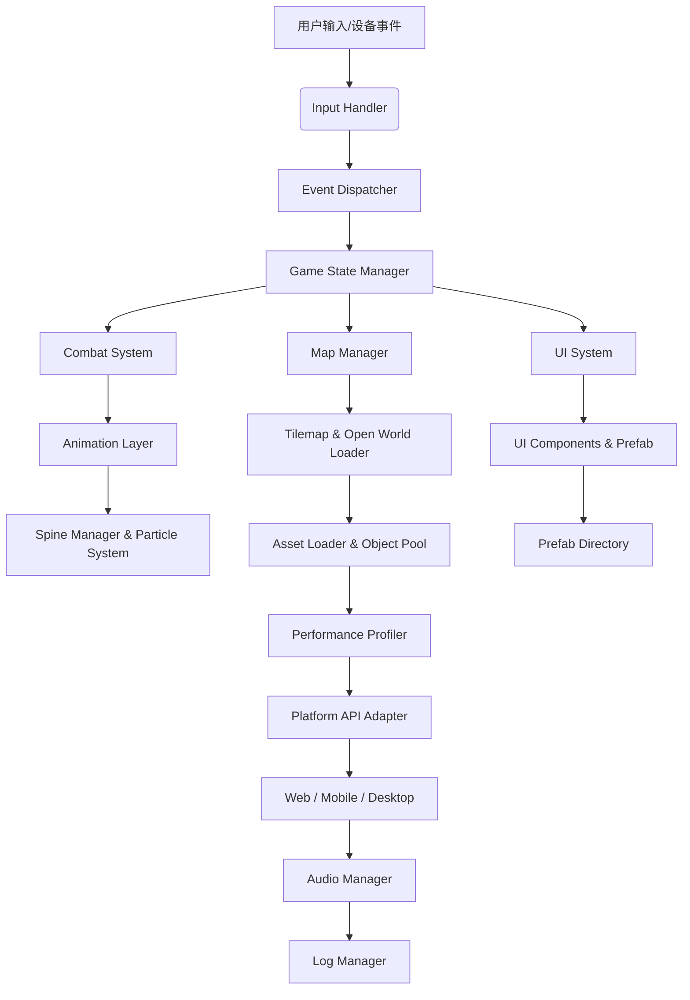
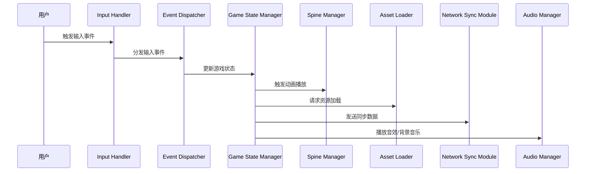

# 《侠义道2》技术文档

## 1. 技术选型与工具链

- **编程语言**：TypeScript  
- **游戏引擎**：Phaser 3（基于 WebGL 渲染）  
- **动画系统**：Spine 集成  
- **打包工具**：Vite  
- **项目管理**：pnpm + Monorepo  
- **多端封装**：  
  - Web：PWA  
  - 移动端：Cordova/Capacitor  
  - 桌面端：Electron  
- **版本控制**：Git（结合 Husky、CommitLint）  
- **测试与监控**：Jest、Chrome DevTools、Lighthouse  
- **CI/CD**：GitHub Actions

---

## 2. 系统架构概述

### 2.1 架构图

以下为系统整体分层架构图（Mermaid 示例）：



---

### 2.2 模块分层设计

#### 2.2.1 渲染层
- **Layer Manager**：管理前景、中景、背景；处理视差、深度排序及缩放  
- **Shader Module**：封装 WebGL Shader，实现动态光影、颜色过滤等

#### 2.2.2 动画层
- **Spine Manager**：加载与解析 Spine 动画数据，提供统一控制接口  
- **Particle & Effects Manager**：管理粒子系统、屏幕震动等视觉特效

#### 2.2.3 逻辑层
- **Game State Manager**：管理全局状态（主菜单、战斗、剧情、在线匹配）  
- **Combat System**：处理战斗逻辑、连招、技能释放与伤害计算  
- **Input Handler**：统一处理键盘、鼠标、触控输入  
- **Event Dispatcher**：实现模块间事件发布/订阅，保证低耦合

#### 2.2.4 资源管理层
- **Asset Loader**：按需加载、预加载与缓存管理  
- **Sprite Atlas Manager**：统一管理精灵图集和批处理  
- **Object Pool**：管理高频对象复用（特效、子弹等）

#### 2.2.5 平台适配层
- **Platform API Adapter**：封装不同平台 API 差异，提供统一接口  
- **Resolution Manager**：根据设备自动适配 UI 布局与资源分辨率  
- **Performance Profiler**：内置调试工具，监控帧率、内存和资源使用

#### 2.2.6 网络层
- **Network Sync Module**：实时同步角色、状态、位置和技能数据  
- **Communication Manager**：处理聊天、组队、匹配等社交功能  
- **Error Recovery & Compression**：延迟补偿、断线重连及数据压缩

#### 2.2.7 地图与开放世界
- **Tilemap Manager**：管理瓦片地图，多层次和属性定义  
- **Open World Loader**：地图分块、流式加载、空间分区与 LOD 实现

#### 2.2.8 预制组件（Prefab）
- **Prefab Directory**：存放常用复用对象、UI 模块、动画模板

#### 2.2.9 音频与日志系统
- **Audio Manager**：管理背景音乐、环境音效、交互音效与语音对话  
- **Log Manager**：记录调试、错误与性能日志

#### 2.2.10 本地化与数据存储
- **Localization Manager**：管理语言包加载，多语言支持  
- **Data Storage**：设计本地存档格式，支持数据加密及云同步接口

---

### 2.3 数据流程图

以下为简单数据流程示意（Mermaid 示例）：



---

### 2.4 优化策略

- **渲染与动画优化**  
  - 强制启用 WebGL；使用图集和批处理减少绘制调用；对 Spine 数据预处理、剔除冗余；粒子系统参数调优
- **逻辑与内存管理**  
  - 使用对象池与分帧更新；动态资源加载；内存监控和垃圾回收调优
- **多端适配**  
  - 响应式 UI 设计；Resolution Manager 自动调整；移动端（Cordova/Capacitor）、桌面端（Electron）优化；跨平台统一打包
- **网络优化**  
  - 采用 UDP 或 WebSocket 实现低延迟数据同步；状态压缩、延迟补偿与断线重连

---

## 3. 部署与 CI/CD

### 3.1 CI/CD 流程

- **触发条件**：Push 或 Pull Request 自动触发  
- **主要流程**：
  1. Checkout 代码  
  2. 设置 Node.js 环境（Node 16）  
  3. 使用 pnpm 安装依赖（利用缓存）  
  4. 运行 Jest 测试  
  5. 分别构建 Web、移动、桌面端应用  
  6. 执行自有部署脚本，将构建产物上传至目标服务器

### 3.2 GitHub Actions 配置示例

```yaml
name: CI/CD Pipeline

on:
  push:
    branches: [ main ]
  pull_request:
    branches: [ main ]

jobs:
  build-test:
    runs-on: ubuntu-latest
    steps:
      - uses: actions/checkout@v3
      - name: Setup Node.js
        uses: actions/setup-node@v3
        with:
          node-version: '16'
          cache: 'pnpm'
      - name: Install Dependencies
        run: pnpm install
      - name: Run Tests
        run: pnpm test
      - name: Build Web App
        run: pnpm --filter web build
      - name: Build Mobile App
        run: pnpm --filter mobile build
      - name: Build Desktop App
        run: pnpm --filter desktop build

  deploy:
    needs: build-test
    runs-on: ubuntu-latest
    if: github.ref == 'refs/heads/main'
    steps:
      - uses: actions/checkout@v3
      - name: Setup Node.js
        uses: actions/setup-node@v3
        with:
          node-version: '16'
          cache: 'pnpm'
      - name: Install Dependencies
        run: pnpm install
      - name: Build Web App for Deployment
        run: pnpm --filter web build
      - name: Run Deployment Script
        run: |
          chmod +x ./deploy.sh
          ./deploy.sh
```

### 3.3 自有部署脚本示例（deploy.sh）

```bash
#!/bin/bash
set -e

# 定义构建目录和目标部署目录
WEB_BUILD_DIR="./apps/web/dist"
DEPLOY_DIR="/var/www/xiayidao2-web"

echo "开始构建 Web 应用..."
pnpm --filter web build

echo "清理目标部署目录..."
rm -rf ${DEPLOY_DIR}/*

echo "复制构建产物到部署目录..."
cp -R ${WEB_BUILD_DIR}/* ${DEPLOY_DIR}/

echo "重启 Web 服务..."
# 示例：使用 PM2 重启服务，确保 xiayidao2 是已配置的进程名称
pm2 restart xiayidao2

echo "部署完成！"
```

- **部署配置**  
  - 配置服务器（如 Nginx）支持 SSL、反向代理  
  - 通过 .env 文件管理环境变量，确保服务器正确加载

---

## 4. 其他补充内容

- **音频系统设计**  
  - Audio Manager 管理背景音乐、环境音效、交互音效和语音对话  
  - 支持混音、淡入淡出和动态音量调整
- **日志系统设计**  
  - Log Manager 记录调试、错误和性能日志  
  - 提供简单可视化接口便于调试
- **本地化支持**  
  - Localization Manager 提供多语言加载接口，便于国际化扩展
- **数据存储设计**  
  - 设计本地存档格式，支持数据加密和完整性校验  
  - 云同步接口预留，支持后续扩展

---

## 5. 总结与未来展望

- **整体目标**  
  构建一款视觉效果精美、交互流畅、跨平台支持且多人在线功能完备的《侠义道2》2.5D 大型武侠游戏  
- **模块化与插件化设计**  
  所有核心功能均采用插件封装，支持懒加载与后续扩展（如社交、商城、更多剧情分支）  
- **迭代开发与分阶段交付**  
  详细排期与 Todo List 帮助单人开发者按计划推进，先实现核心功能，再逐步扩展复杂交互、网络同步、地图开放世界等模块  
- **跨平台与多分辨率适配**  
  始终确保对 Web、平板、手机和桌面等设备的支持，提供优秀用户体验  
- **CI/CD 与自有部署**  
  通过 GitHub Actions 与自有部署脚本实现自动化测试、构建、打包与部署  
- **风险与维护**  
  预留充足缓冲期应对单人开发风险，定期更新文档和代码，确保长期维护与后续扩展
